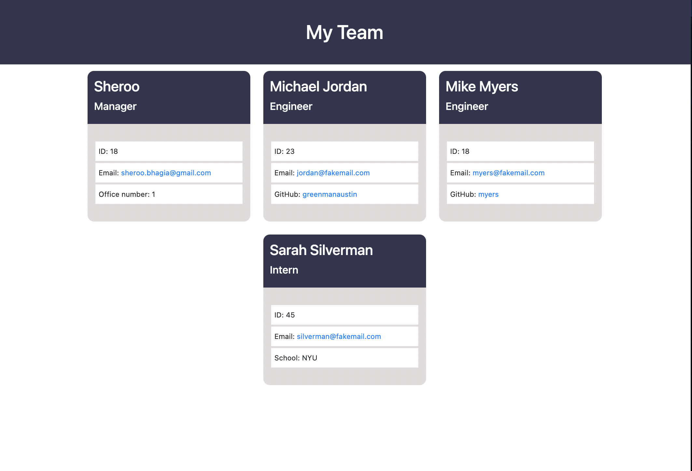

# Team-Profile-Generator

 ## Description

 This application was created to generate a team profile based on user input using the Inquirer module from Node.js and displaying the information on a newly created html page with a style sheet. This project demonstrates use of OOP and TDD using Jest.

## Table of Contents

  
  - [Installation](#installation)
  - [Usage](#usage)
  - [Contributing](#contributing)
  - [Tests](#tests)
  - [License](#license)
  - [Questions](#questions)

  ## Installation

  The user should clone the repository from GitHub and download Node. This application also requires a file system and inquirer module. If testing is required, this application uses Jest.

  ## Usage

  Type "Node index.js" in the terminal when in the same directory as that file.  The follow the prompts to answer questions about your project. After you are done, the application will generate a index.html file in the "dist" folder, which is located in the root directory.  Open that file in a brower to see the results of the application.  View walk through video here - <a href="https://drive.google.com/file/d/1-nJ3OfFyqdNksvq3Jh9mKtYtkpZh8817/view?usp=sharing">Screencastify</a>

  ## Contributing

  All comments and suggestions will be carefully considered and will be greatly appreciated.

  ## Tests

  Run npm test to run Jest for tests on constructors.

  ## Questions

  My Github page is: https://github.com/greenmanaustin

  You can reach me with questions at: sheroo.bhagia@gmail.com